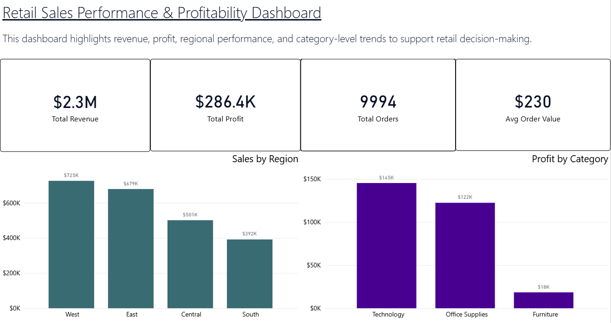
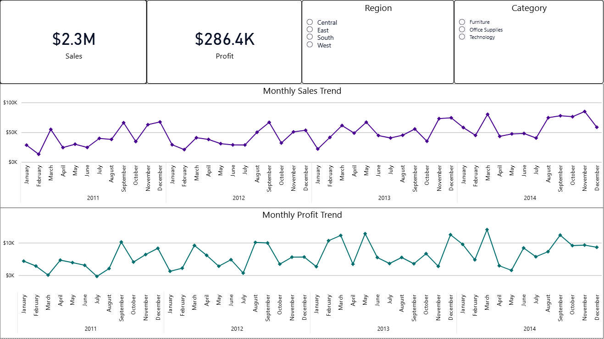
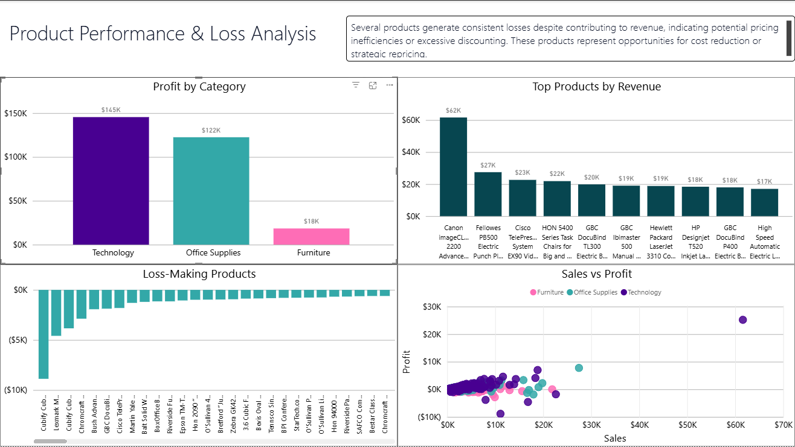

# retail-sales-bi-dashboard
A Business Intelligence solution analyzing retail sales, profitability, customer behavior, and product performance.
# Retail Sales Performance & Profitability BI Dashboard

## Overview

This project analyzes retail sales data to evaluate revenue performance, profitability, and customer behavior. The goal was to identify trends, highlight underperforming areas, and provide actionable insights to support business decision-making.

---

## Business Problem

A retail company has strong overall sales but lacks visibility into which regions, products, and customers are driving performance. Additionally, the company needs to identify products that are generating losses despite contributing to revenue.

---

## Tools & Technologies

* SQL (data cleaning and preparation)
* Power BI (data modeling and dashboard development)
* Power Query (data transformation)
* DAX (calculated measures)

---

## Data Source
The dataset used in this project is the Superstore Sales dataset, publicly available on Kaggle:

https://www.kaggle.com/datasets/vivek468/superstore-dataset-final

---

## Data Preparation

The dataset was cleaned and standardized using SQL. Column names were normalized and inconsistent date formats were resolved to ensure accurate time-based analysis. Additional transformations were completed in Power Query to finalize data types and structure for reporting.

---

## Key Metrics

* Total Revenue: $2.3M
* Total Profit: $286K
* Total Orders: 9,994
* Average Order Value: $230

---

## Dashboard Features

The dashboard is structured across three main views:

### 1. Executive Overview

* Revenue, profit, order volume, and average order value
* Sales by region
* Profit by category

### 2. Sales Trends

* Monthly sales and profit trends
* Interactive filters for region and category

### 3. Product Performance & Loss Analysis

* Top-performing products by revenue
* Identification of loss-making products
* Profitability breakdown by category
* Sales vs. profit comparison

---

## Key Insights

* The West region generates the highest revenue, while the South region underperforms.
* Sales trends indicate fluctuations over time, suggesting potential seasonality.
* Several products generate high revenue but negative profit, with losses exceeding $8,000 for the worst-performing items.
* High sales volume does not necessarily correlate with profitability, highlighting inefficiencies in pricing or cost structure.

---

## Business Recommendations

* Reevaluate pricing and discount strategies for loss-making products.
* Investigate cost structures or supplier agreements for consistently unprofitable items.
* Focus growth efforts on high-performing regions while developing strategies to improve underperforming areas.
* Incorporate profitability metrics alongside revenue in decision-making processes.

---

## Files Included

* `Retail_Dashboard.pbix` – Power BI dashboard file
* `retail_sql_queries.sql` – SQL scripts used for data analysis
* `dashboard_screenshots` – Images of dashboard pages

---

## Project Preview

### Executive Overview

### Sales Trends

### Product Performance & Loss Analysis

---

## About Me

Aspiring Business Intelligence Analyst with a background in data analytics and business strategy. Passionate about turning data into actionable insights and building dashboards that support real-world decision making.
